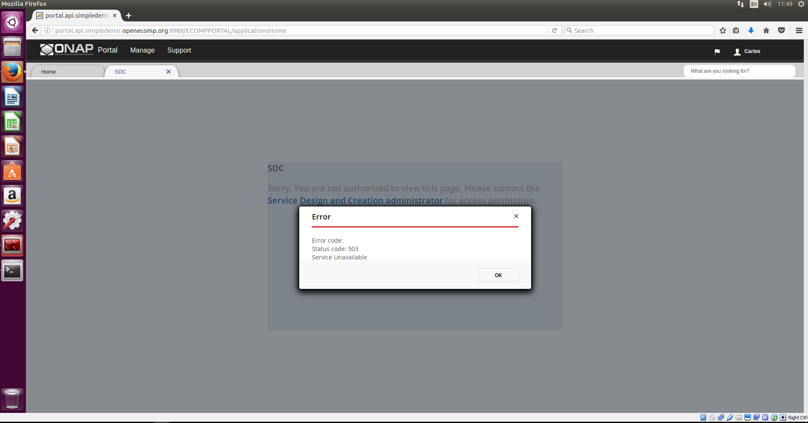

# Start Up ONAP based on VIO 4.0

目录：

  + [环境配置](#环境配置)
  + [ONAP配置](#onap配置)
  + [ENV文件](#env文件)
  + [ONAP中可能出现的问题](#onap可能出现的问题)

    + [sdc服务不可用](#sdc服务不可用)

## 更新日志

  * 2017-9-6

    * 添加[基于VIO部署ONAP的技巧](onap_based_on_vio.md)(主要是为了应对vio环境的不稳定性)

  * 2017-9-5

    * 更新robot中container的ssl问题，详情见[robot中的ssl问题](#robot中的ssl问题)

      + 主要文件

        + [keystone-proxy.conf](ConfigFile/keystone-proxy.conf)
        + [keystone.conf](ConfigFile/keystone.conf)

  * 2017-9-1

    * 解决robot中container的ssl问题，详情见[robot中的ssl问题](#robot中的ssl问题)

        + 主要文件

          + [haproxy.cfy](ConfigFile/haproxy.cfg)
          + [local_setting.py](ConfigFile/local_setting.py)
          + [keystone.txt](keystone.txt)

  * 2017-8-29

    + 排查SDC中BE启动失败问题，详情如下[SDC服务不可用](#sdc服务不可用)

  * 2017-8-25

    + 添加ONAP搭建过程，详情见[环境准备](#环境准备)、[ONAP配置](#ONAP配置)、[ENV文件](#ENV文件)
    + 添加基本VIO的ONAP的配置文件

      + 源文件

        + [onap_openstack_float.env](ConfigFile/onap_openstack_float.env)
        + [onap_openstack_float.yaml](ConfigFile/onap_openstack_float.yaml)

      + 修改后的文件

        + [onap_vio.env](ConfigFile/onap_vio.env)
        + [onap_vio.yaml](ConfigFile/onap_vio.yaml)

## 环境准备

  1. Linux VM，作为Heatclient的工具

  * 安装python环境、OpenstackClient、HeatClinet，并配置相应的环境变量

    参考如下：
    ```
    $ apt install python, python-pip
    $ pip install virtualenv, virtualenvwrapper
    $ pip install python-openstackclient, python-heatclient

    # 下载VIO的OpenStack RC文件，并进行配置
    $ source admin-openrc.sh
    ```

    参考链接：

    [https://access.redhat.com/documentation/en-US/Red_Hat_Enterprise_Linux_OpenStack_Platform/5/html/End_User_Guide/install_clients.html](https://access.redhat.com/documentation/en-US/Red_Hat_Enterprise_Linux_OpenStack_Platform/5/html/End_User_Guide/install_clients.html)

    [https://developer.rackspace.com/docs/cloud-orchestration/v1/getting-started/send-request-ovw/](https://developer.rackspace.com/docs/cloud-orchestration/v1/getting-started/send-request-ovw/)

    [https://access.redhat.com/documentation/en-US/Red_Hat_Enterprise_Linux_OpenStack_Platform/5/html/End_User_Guide/cli_openrc.html](https://access.redhat.com/documentation/en-US/Red_Hat_Enterprise_Linux_OpenStack_Platform/5/html/End_User_Guide/cli_openrc.html)

  * 可能出现的问题

    + heatclient不能正常访问heatservice服务，出现SSL问题

    解决办法一：使用`--insecure`选项

    ```
    $ heat --insecure service-list
    ```

    解决办法二：使用vio.pem文件

    ```
    # 进入到VIO所在主机，将/etc/ssl/vio.pem 拷贝至heatclient所在主机的/etc/ssl/vio.pem
    # 向admin-openrc.sh添加OS_CACERT环境变量
    # export OS_CACERT=/etc/ssl/vio.pem
    $ source admin-openrc.sh
    $ openstack server list
    ```

    Ref:

    [https://blogs.vmware.com/openstack/prepare-a-linux-vm-for-managing-openstack/](https://blogs.vmware.com/openstack/prepare-a-linux-vm-for-managing-openstack/)

    解决办法三：turn off VIO中环境的verify机制

    Ref：

    [https://docs.openstack.org/mitaka/install-guide-obs/keystone-verify.html](https://docs.openstack.org/mitaka/install-guide-obs/keystone-verify.html)

  2. Linux VM信息，用于登录ONAP中的VMs

  Linux_VM_IP : 10.110.141.221  
  User/Passwd: subond/123

  ```
  $ ssh subond@10.110.141.221
  ```

  3. Linux VM中ONAP相关的信息

  ```
  # VIO的rc文件地址为 /home/subond/heatclient/admin-openrc.sh
  $ source admin-openrc.sh

  # ONAP源码路径为 /home/subond/ONAP825/demo
  # Heat Template文件 /home/subond/ONAP825/demo/heat/ONAP/onap_vio.yaml
  # Heat Template 环境配置文件 /home/subond/ONAP825/demo/heat/ONAP825/onap_vio.env

  # 登录ONAP VMs的私钥路径为 /home/subond/heatclient/onap_rsa
  $ ssh -i onap_rsa ubuntu@OANP_VM_FloatingIP

  # 查看各VMs的ip地址
  $ openstack --insecure server list
  ```

## ONAP配置

  * Network

    public: 10.154.9.0/24网段：用于VM的FloatingIp

    Internal: 192.168.15.0/24网段：用于VM私网地址

  * Image

    ubuntu-14.04-server-cloudimg-amd64
    ubuntu-16.04-server-cloudimg-amd64

    Ref:

    [https://cloud-images.ubuntu.com/releases/](https://cloud-images.ubuntu.com/releases/)

  * Flavor

    |Flavor Name|vCPUs|RAM|Root Disk|
    |:--|:--|:--|:--|
    |onap.tiny|1|512MB|4GB|
    |onap.small|1|1GB|10GB|
    |onap.medium|2|2GB|20GB|
    |onap.large|4|4GB|50GB|
    |onap.xlarge|8|16GB|50GB|

## ENV文件

  * ONAP REPO的时间及分支：25/Aug/2017, master

  * ENV文件：参照VIO系统环境，设定ONAP环境变量

    * router_gateway_ip: 用于ONAP系统的Router ip的设定，选VIO环境中可用的public IP即可

    * dns_list, external_dns: dns的设定需使用VIO外部环境可用的DNS服务，即10.142.7.21(VIO环境中)

  * 源文件

    + [onap_openstack_float.env](ConfigFile/onap_openstack_float.env)
    + [onap_openstack_float.yaml](ConfigFile/onap_openstack_float.yaml)

  * 修改后的文件

    + [onap_vio.env](ConfigFile/onap_vio.env)
    + [onap_vio.yaml](ConfigFile/onap_vio.yaml)

## ONAP中可能出现的问题

### sdc服务不可用

  错误现象：

  

  排查方法：

  第一步：进入SDC所在的主机，查看各CONTAINER是否正常；  
  第二步：利用SDC自身脚本检查SDC中各服务的异常情况；  
  第三步：对SDC中有问题的服务进行单独log检查。

  具体参考如下：

  ```
  # 进入SDC所在的主机，Ip地址为10.154.9.75
  $ ssh -i onap_rsa ubuntu@10.154.9.75

  # 查看CONTAINER情况
  $ sudo docker ps -a

  # SDC自身检查脚本 /data/scripts/docker_health.sh
  $ ./docker_health.sh
  # 亦可直接调用health检查方法
  # http://localhost:8181/sdc1/rest/healthCheck
  # http://localhost:8080/sdc2/rest/healthCheck
  $ curl http://localhost:8181/sdc1/rest/healthCheck
  $ curl http://localhost:8080/sdc2/rest/healthCheck

  # 对SDC中各服务(BE, ES, FE等)进行单独排查
  # 其log文件位于 /data/logs/
  # BE的错误日志 /data/logs/BE/SDC/SDC-BE/error.log
  $ cat error.log
  2017-08-29T02:05:36.661Z|||||ES-Health-Check-Thread|||SDC-BE||||||||ERROR||||192.168.15.35||o.o.sdc.be.dao.impl.ESCatalogDAO||ActivityType=<?>, Desc=<Error while trying to connect to elasticsearch. host: [10.154.9.75:9300] | port: 9200 | error: None of the configured nodes are available: [{#transport#-1}{10.154.9.75}{10.154.9.75:9300}]>org.elasticsearch.client.transport.NoNodeAvailableException: None of the configured nodes are available: [{#transport#-1}{10.154.9.75}{10.154.9.75:9300}]
  ```

  错误原因：

  BE不能连接至ES，进一步原因是VIO中不支持VM访问自身的FloatingIp。

  解决办法：清除SDC VM中的FloatingIp信息，然后重启服务。

  具体参考如下：

  ```
  # SDC VM中FloatingIp的信息的位置 /opt/config/public_ip.txt
  $ cd /opt/config/
  $ mv public_ip.txt public_ip.txt.break

  # SDC中各服务通过挂载VOLUME的方式进行工作，因此，重启服务前需注释掉sfdisk相关代码，并清除相关数据
  # sfdisk相关代码位置 文件/opt/asdc_install.sh中84-88行(基于ONAP 2017-8-25 master分支源码)
  # 相关代码如下
  # 84 # sfdisk /dev/$DISK < /opt/asdc_ext_volume_partitions.txt
  # 85 # mkfs -t ext4 /dev/$DISK"1"
  # 86 # mkdir -p /data
  # 87 # mount /dev/$DISK"1" /data
  # 88 # echo "/dev/"$DISK"1  /data           ext4    errors=remount-ro,noatime,barrier=0 0       1" >> /etc/fstab

  # 清空相关数据，位置/data/
  $ rm -rf /data/*

  # 删除所有的CONTAINER，并重启服务，即重新运行脚本/opt/asdc_install.sh
  $ sudo docker rm $(sudo docker ps -a -q)
  $ cd /opt/
  $ sudo ./asdc_install.sh
  ```

### robot中的ssl问题

  错误现象

  在robot VM中执行检查(例如 `./demo.sh init`和`./ete.sh health`)时，container出现ssl认证失败。

  

  原因分析

  VIO环境中使用的时HTTPS协议，需要SSL的私钥认证，而robot中的container中没有相关私钥信息，导致认证失败。

  解决办法

  取消VIO中环境中的SSL认证过程。需要注意的是，VIO中SSL的认证过程由haproxy负责，OpenStack相关的配置，一般为默认选项。

  主要步骤如下：

  第一步：修改haproxy相关配置(包括haproxy.cfg, keystone-proxy.conf, keystone.conf)，并重启服务。
  第二步：修改OpenStack endpoint相关信息。
  第三步：修改robot中的配置信息，并重新启动服务。

  参考过程如下：

  第一步：修改haproxy相关配置，并重启服务。需要注意的是，VIO环境中Keystone相关服务配置在apache2上，随apache2一起启动。因此，apache2中关于keystone的配置也要相关的进行修改。

  ```
  # haproxy的配置文件 /etc/haproxy/haproxy.cfy
  # 将相应的listen下bing项中删除ssl相关信息

  # 修改前
  #  38 listen keystone-public
  #  39  bind 10.154.2.225:5000 ssl crt /etc/ssl/vio.pem
  #  40  balance roundrobin
  #  41  option http-server-close
  #  42  option httplog
  #  43  option forwardfor
  #  44  fullconn 1024
  #  45  redirect scheme https code 301 if { hdr(host) -i 10.154.2.225 } !{ ssl_fc }
  #  46  # redirect scheme http code 301 if { hdr(host) -i 10.154.2.225 } !{ ssl_fc }
  #  47  rsprep ^Location:\ http://(.*) Location:\ https://\1
  #  48  rsprep ^Location:\ http://(.*) Location:\ http://\1
  #  49     server loadbalancer01 10.154.9.82:5001 check inter 3000
  # 修改后
  #  38 listen keystone-public
  #  39  bind 10.154.2.225:5000
  #  40  balance roundrobin
  #  41  option http-server-close
  #  42  option httplog
  #  43  option forwardfor
  #  44  fullconn 1024
  #  45  redirect scheme https code 301 if { hdr(host) -i 10.154.2.225 } !{ ssl_fc }
  #  46  # redirect scheme http code 301 if { hdr(host) -i 10.154.2.225 } !{ ssl_fc }
  #  47  rsprep ^Location:\ http://(.*) Location:\ https://\1
  #  48  rsprep ^Location:\ http://(.*) Location:\ http://\1
  #  49     server loadbalancer01 10.154.9.82:5001 check inter 3000

  # 除了horizon外，其他listen的相应服务也要改；horizon保持默认即可，如下所示
  # 162 listen horizon
  # 163  timeout client 300s
  # 164  timeout client-fin 30s
  # 165  timeout server 300s
  # 166  timeout server-fin 30s
  # 167  bind 10.154.2.225:80
  # 168  bind 10.154.2.225:443 ssl crt /etc/ssl/vio.pem

  # 修改本地配置文件 /etc/openstack-dashboard/local_setting.py
  # 将FEDERATION_AUTH_URL = 'https://10.154.2.225:5000/v3'改为FEDERATION_AUTH_URL = 'http://10.154.2.225:5000/v3'

  # 重启haproxy服务
  $ service haproxy restart

  # 修改apache2中相应的Keystone文件
  # 文件目录：/etc/apache2/sites-available
  # 三个文件: keystone-proxy.conf, keystone.conf
  # 将其中的https替换为http
  # 替换后如下：
  # 文件keystone-proxy.conf
  # <VirtualHost 10.154.9.72:5001>
  # ProxyPass / http://10.154.9.72:5000/
  # ProxyPassReverse / http://10.154.9.72:5000/
  # ...
  # Substitute "s|http://10.154.9.72|http://10.154.2.225|i"

  # <VirtualHost 10.154.9.72:5359>
  # ProxyPass / http://10.154.9.72:35357/
  # ProxyPassReverse / http://10.154.9.72:35357/
  # ...
  # Substitute "s|http://10.154.9.72|http://10.154.2.225|i"

  # 文件: keystone.conf
  # 替换后如下：
  # ServerName http://10.154.2.225:5000
  ```

  第二步：修改openstack endpoint。将endpoint的带有https的url全部disable，然后创建新的endpoint

  ```
  # 以keystone public为例
  $ openstack endpoint list
  # ID                               | Region | Service Name | Service Type   | Enabled | Interface | URL                                          
  # 6c600fda93154ccd947fcbf967eec27b | nova   | keystone     | identity       | True    | public    | https://10.154.2.225:5000/v3

  $ openstack endpoint create --region nova keystone public http://10.154.2.225:5000/v3
  $ openstack endpoint set --disable 6c600fda93154ccd947fcbf967eec27b
  $ openstack endpoint list
  # ID                               | Region | Service Name | Service Type   | Enabled | Interface | URL                                          
  # 6c600fda93154ccd947fcbf967eec27b | nova   | keystone     | identity       | False   | public    | https://10.154.2.225:5000/v3
  # 0e6c1493c9de403397291ece700c205b | nova   | keystone     | identity       | True    | public    | http://10.154.2.225:5000/v3
  ```

  第三步：第三步：修改robot中的配置信息，并重新启动服务。

  ```
  # 将/opt/config/keystone.txt中的https://10.154.2.225:5000/v3改为http://10.154.2.225:5000/v3
  # 删除容器
  $ sudo docker rm $(sudo docker ps -a -q)
  # 重启容器
  $ cd /opt
  $ sudo ./robot_install.sh
  ```
